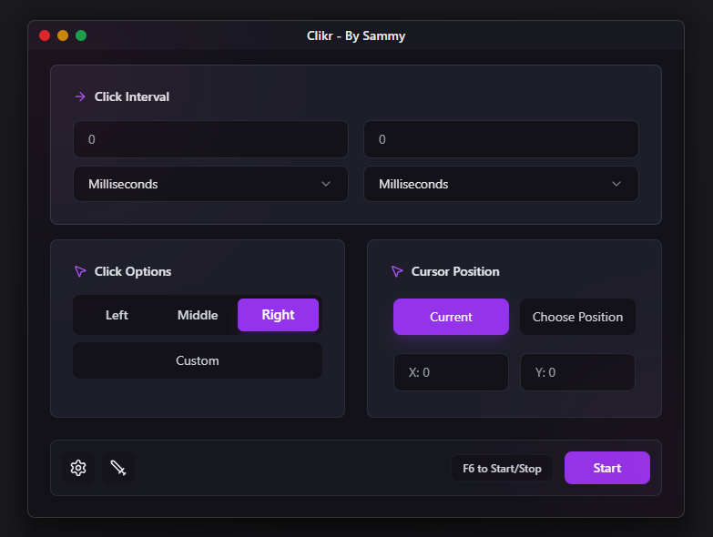

# Clikr 🗿

A modern, cross-platform auto-clicker built with **Tauri**, **React**, and **TypeScript**.



## ✨ Features

- **📱 Cross-Platform**: Works on Windows, macOS, and Linux
- **🎨 Modern UI**: Beautiful dark/light theme with smooth animations and transitions
- **⌨️ Custom Keybindings**: Set custom hotkeys


## 🚀 Quick Start

### Requirements

- **Node.js**
- **Rust**
- **pnpm**

### Installation

1. **Clone the repository**
   ```bash
   git clone https://github.com/kauht/Clikr
   cd clikr
   ```

2. **Install dependencies**
   ```bash
   pnpm install
   ```

3. **Run in development mode**
   ```bash
   pnpm tauri dev
   ```


## 🛠️ Tech Stack

- **Frontend**: React + TypeScript + Tailwind CSS
- **Backend**: Rust (Tauri)
- **UI Components**: Shadcn/UI + Lucide icons
- **Styling**: Tailwind CSS

## Development Progress

### ✅ Completed

- [x] Center the "Auto Clicker" label
- [x] Make nav bar buttons work
- [x] Improve color scheme
- [x] Make color palette instead of manually entering colors 
- [x] Make theme work (use Tailwind dark/light mode feature)
- [x] Disable inspect element and right click

### 🚧 In Progress / Planned

- [ ] Add splash screen on startup
- [ ] Clean up code
- [ ] Change icon for "Record & Playback" button
- [ ] Add DPI scaling settings (default changes based on resolution)
- [ ] Improve settings menu transition animation
- [ ] Make click options select slider into a component
- [ ] Add presets options to the settings
- [ ] Make hotkey selector work
- [ ] Make custom click keybind selector work (default to space)
- [ ] Add menu for Record & Playback button
- [ ] Make "Click Options" and "Cursor Position" icons different
- [ ] Significantly improve Select box dropdown component
- [ ] Add Coordinates selector feature for custom X and Y
- [ ] Think of a better name for this app
- [ ] Find domain for website
- [ ] Make start/stop functions `beginClicker(interval, key, pos)` (Autoclicker always running in its own thread, using atomic bool for autoclicker start/stop)
- [ ] Add Backend-Frontend variables for clicker speed

## 🤝 Contributing

Contributions are always welcome! Feel free to submit a Pull Request.

## 📄 License

This project is licensed under the MIT License - see the [LICENSE](LICENSE) file for details.
---

**Made with ❤️ by [@kauht](https://discord.gg/WVMHUgrgeH)**
